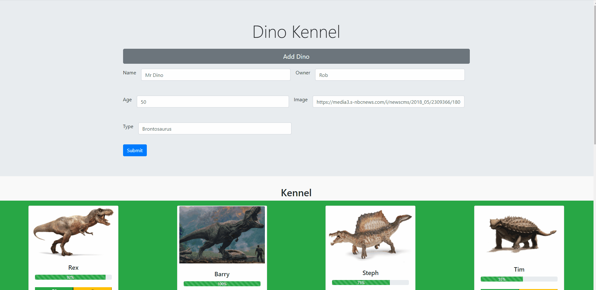
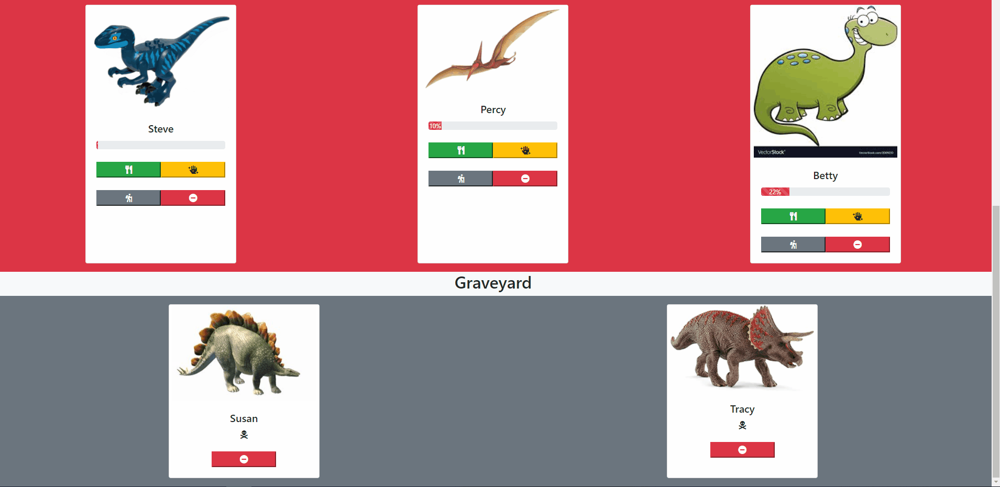

# Dino Kennel

Dino Kennel is a single page application that lets the user be in charge of a dinosaur kennel. The user can add their own dinosaurs to the kennel. The user can also feed and pet the dinos and send them on adventures, and can click on the dino to get more information on them.

## Details

This application uses JavaScript modules to separate functions by use. It is almost completely styled using Bootstrap classes. Bootstrap cards, forms, modals and jumbotron are used. JQuery is used liberally, especially on(click), append(), and remove(). Everything that is visible on the page has been printed to the DOM using JavaScript, except the Jumbotron and section names.

## How to Use

When the user visits that application, some dinos are already populated in each section: the Kennel, Hospital, and Graveyard. An add dino button can be clicked on which populates a form. The form must be completely filled out in order to be able to create a new dino. The add dino button can also be clicked again to hide the form, and the submit button will clear and hide the form.

Each dino (except those in the Graveyard) can be fed and petted to increase the dino's health. The dino can also be sent on an adventure, which will increase or decrease the dino's health based on whether the dino succeeded or failed the adventure. The dino will automatically move to the Kennel if their health is above 30, to the Hospital if their health is 30 or lower but above 0, and to the graveyard if their health is at 0.

When a dino's picture is click it brings up a modal with more information on the dino, including the owner, type, and the adventures they've gone on, including whether they've succeeded or failed at the adventures.

Dinos can be removed from the application as well, which is the only button available for dinos in the Graveyard section.

## Technologies Used

HTML, JavaScipt, Bootstrap, Modules, very light CSS.

## Link

[Link to the application](https://bandstrar-dino-kennel.netlify.app/)